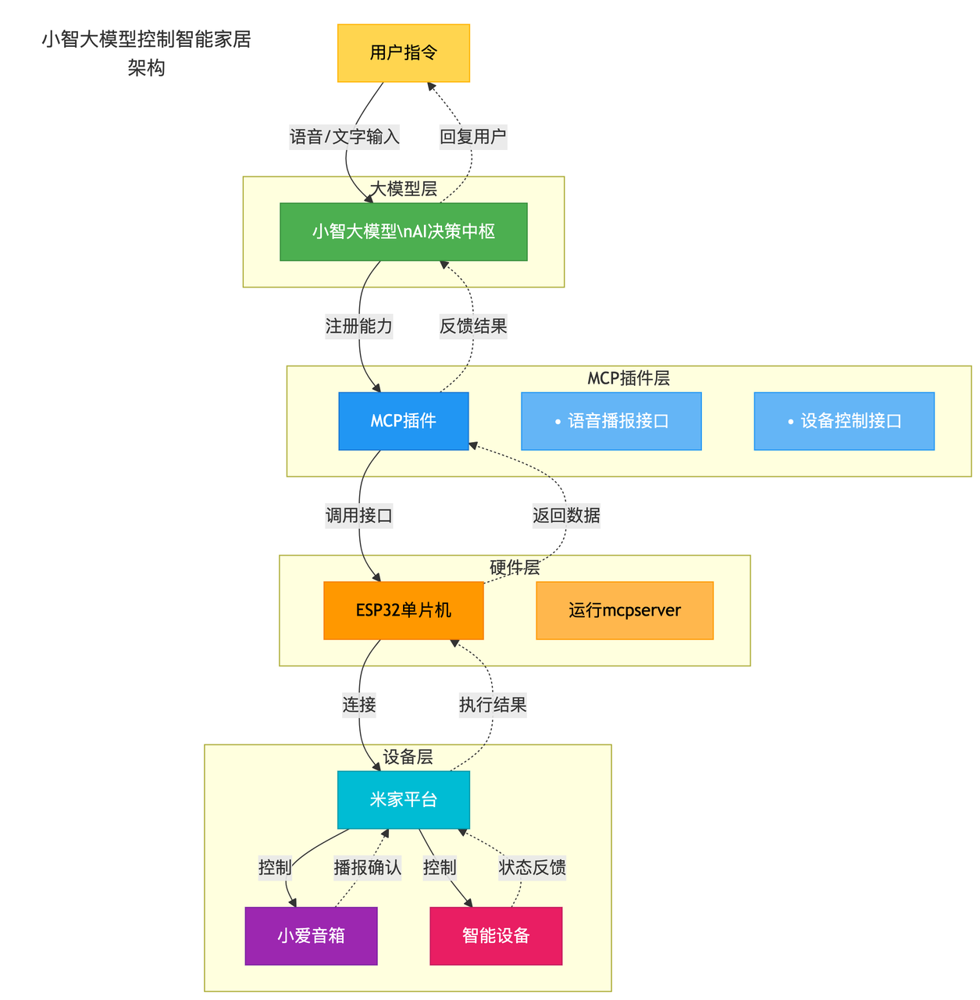

# MCP 大模型智能家居网关

<div align="center">


**基于ESP32的智能家居控制系统，通过MCP协议实现大模型对米家、涂鸦平台设备的深度控制，提供mcpserver 接口，可供大模型直接调用，目前已接入小智智能体，扣子空间，coze智能体。**

[](https://b23.tv/0KlOaJY)
[](https://bxk64web49.feishu.cn/docx/XAVJdha5FoI5bjxKELqcz3rJnwg)
[](https://gitee.com/panzuji/ha-esp32/releases/)

</div>

---

## 🚀 技术架构

<div align="center">



</div>

---

## ✨ 核心功能

### 🤖 平台集成

**米家、涂鸦平台深度集成**
- 小爱音箱设备控制（支持40+款型号）
- 涂鸦设备精准控制
- 场景联动执行

**Coze、扣子空间生态扩展**
- 飞阳MCP网关插件（[安装地址](https://www.coze.cn/store/plugin/7523201219662184483)）
- [接入教程](https://bxk64web49.feishu.cn/docx/XRBGdxUl2oDDQHxiBrOcZi1KnGj)

### 🎛️ 控制模式

**小爱音箱指令转发**
- 支持40+款小爱音箱型号
- 语音指令智能解析转发

**平台接口直连控制**
- 米家设备直接控制
- 涂鸦设备直接控制

### 🔊 音频能力

**小爱TTS文本播报**
- 智能语音合成播报
- 系统通知语音推送

**小爱在线音乐播放**
- 音乐播放控制
- 音量调节管理

**场景联动执行**
- 智能场景触发
- 多设备协同控制

### 📡 开放接口

**云平台HTTP接口**
- HTTP接口开放（[接口文档](https://oneapi.sooncore.com/openapi/)）
- RESTful API支持

**标准MCP Server接口**
- MCP协议服务器
- 支持多种大模型接入

### 📱 配置与兼容

**微信小程序便捷配置**
- 飞阳智控小程序
- 可视化设备管理

**全面兼容虾哥小智设备**
- 虾哥小智设备兼容（MCP协议）
- 无缝对接现有设备生态

### ⚡ MCP服务器

- MCP协议服务器
- 支持多种大模型接入

**配置示例：**
auth = MfDPyOWUSraqHsuH  # 填入网关设备密钥

```json
{
  "mcpServers": {
    "feiyang": {
      "url": "https://oneapi.sooncore.com/sse?auth=MfDPyOWUSraqHsuH",
      "disabled": false,
      "timeout": 60,
      "type": "sse",
      "autoApprove": []
    }
  }
}
```

### 📲 微信小程序

- 飞阳智控小程序

---

## 🎯 功能演示

### 📝 语音指令示例

#### 🔧 设备控制

```text
"让北京的小爱同学，打开客厅灯"
"打开客厅空调"
"家里有哪些设备在线"
"家里有几个空调"
"家里的台灯有哪些功能"
"客厅的台灯现在是什么状态"
```

#### 🔊 TTS播报

```text
"小爱同学，播报系统通知"
"让北京的小爱同学介绍一下自己"
```

#### 🎵 音乐播放

```text
"让北京的小爱同学，播放周杰伦的歌曲"
"让北京的小爱同学，音量调到50%"
```

#### 🏠 场景联动

```text
"启动回家模式"
"启动离家模式"
```

---

## 🛒 购买成品网关

<div align="center">

### 扫码购买

| 购买二维码 | 产品展示 |
|:---:|:---:|
|  |  |

</div>

---

## 📄 许可证

本项目采用**非商业用途许可证** - 查看 [LICENSE](LICENSE) 文件了解更多信息。

### 🔒 使用条款

- ✅ **个人免费使用**：个人学习、研究、非商业用途完全免费
- ✅ **开源贡献**：欢迎提交代码改进和功能完善
- ✅ **技术交流**：支持技术讨论和经验分享
- ❌ **商业使用**：禁止将本项目用于任何商业用途
- ❌ **销售盈利**：禁止基于本项目进行销售或盈利活动
- ❌ **商业部署**：禁止在商业环境中部署使用

如需商业授权，请联系作者获得商业许可。

---

## 🤝 贡献

欢迎提交 Issue 和 Pull Request 来帮助改进项目。

---

<div align="center">

**如果这个项目对您有帮助，请给一个 ⭐ Star**

</div>
