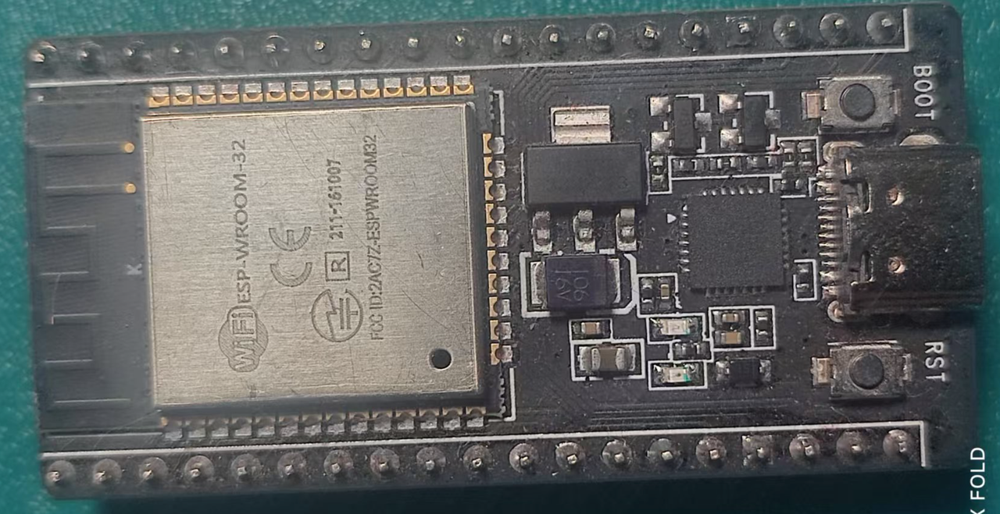

# MCP大模型智能家居网关


## 项目简介

基于ESP32的智能家居控制系统，让大模型直接操控小爱音箱和智能设备

[演示视频](https://b23.tv/0KlOaJY) | [完整教程](https://bxk64web49.feishu.cn/docx/XAVJdha5FoI5bjxKELqcz3rJnwg) | [固件下载](https://gitee.com/panzuji/ha-esp32/releases/)

---

> **声明**
>
> - 本仓库仅提供编译后的固件，源代码未开放
> - 使用前请仔细阅读 [LICENSE](LICENSE) 协议

## 📖 项目简介

本项目是一个基于ESP32的智能家居控制系统，通过MCP（模型上下文协议）插件，实现大模型"小智"对小爱音箱和米家智能设备的深度集成控制。

### ✨ 主要特性

- **🤖 AI深度集成**：不仅是对话，更是智能控制
- **🔌 MCP插件架构**：将语音播报和设备控制封装为标准服务
- **🏠 全屋智能**：支持米家生态链设备统一管理
- **💡 智能交互**：自然语言直接转换为设备操作

## 🚀 技术架构


### 🔧 实现原理

**MCP（模型上下文协议）** 作为连接大模型与硬件设备的桥梁，将小爱音箱的核心功能（语音播报、设备控制）注册为标准化插件。当"小智"AI助手识别到相关指令时，会自动调用对应的硬件接口。

#### 核心组件

1. **🔗 米家平台对接**：ESP32与米家云服务深度集成，实现设备状态同步和控制
2. **⚡ MCP服务接口**：标准化的插件接口，便于AI模型理解和调用
3. **💾 ESP32固件**：高性能、低成本的硬件方案，支持多设备并发控制

通过这套架构，您将拥有一个由AI驱动的智能家居控制中枢，让人工智能的理解力直接作用于物理世界。

## 🎯 功能演示

### 📱 设备查询

**用户指令**：`"你好小智，家里有哪些设备在线？"`

**执行结果**：小智在聊天界面显示查询结果

```text
✅ 检测到以下设备在线：
- 客厅台灯 (在线)
- 卧室空调 (在线)
- 厨房插座 (离线)
```

### 🎛️ 设备控制

**用户指令**：`"帮我把客厅的台灯打开，调亮一些，暖色调"`

**执行结果**：

- 客厅台灯自动开启
- 亮度调节至80%
- 色温切换至暖光模式

### 🔊 语音播报

**用户指令**：`"让小爱播报：欢迎来到阳阳学编程频道！"`

**执行结果**：小爱音箱清晰播报指定内容

> 💡 **智能交互流程**：自然语言指令 → AI理解意图 → 调用MCP插件 → ESP32执行 → 设备响应

## 🎵 支持的小爱音箱型号

| 系列 | 支持型号 |
|------|----------|
| **Classic系列** | `07G`, `16B`, `L04M`, `L05B`, `L05C`, `L05G`, `L06A` |
| **LX系列** | `LX01`, `LX04`, `LX05`, `LX06`, `LX5A` |
| **Pro系列** | `L09A`, `L09B`, `L15A`, `L16A`, `L17A`, `L7A` |
| **X系列** | `X08A`, `X08C`, `X08E`, `X10A`, `X4B`, `X6A`, `X8F`, `X8S` |
| **其他** | `M03A`, `OH2`, `OH2P`, `S12` |

### 💻 支持的ESP32硬件

#### ✅ 推荐配置

ESP32-S3-R16N8（已完全验证）

- 16MB PSRAM + 8MB Flash
- 完整功能支持，包括在线升级


#### ⚠️ 基础配置

ESP32 (Flash > 4MB)

- 基础功能支持
- 在线升级功能不可用



### 📥 固件下载地址

**最新版本**：v1.0.15  
**发布时间**：2025年6月15日

🔗 **下载链接**：[https://gitee.com/panzuji/ha-esp32/releases/tag/v1.0.15](https://gitee.com/panzuji/ha-esp32/releases/tag/v1.0.15)

#### 📋 固件文件说明

| 文件名 | 适用设备 | 说明 |
|--------|----------|------|
| `esp32.esp32.esp32_flash4M_1.0.15.zip` | ESP32 (4MB Flash) | 基础功能，无在线升级 |
| `esp32.esp32.esp32_flash8M_1.0.15.zip` | ESP32 (8MB Flash) | 完整功能支持 |
| `esp32.esp32.esp32s3_flash8M_1.0.15.zip` | ESP32-S3 (推荐) | 最佳性能，完整功能 |

> 💡 **下载提示**：建议选择ESP32-S3版本以获得最佳性能和完整功能支持

## 📱 替代方案：安卓版小智

如果暂时没有ESP32硬件，可以使用安卓版本的小智客户端，同样能实现基本的智能控制功能。

### 配置步骤

1. 安装安卓版小智应用
2. 在设置页面填入以下信息：
   - **WebSocket地址**：服务器连接地址
   - **MAC地址**：需与小智官网 <https://xiaozhi.me> 注册的ESP32设备MAC地址一致


## 🔧 固件烧录教程

### ESP32-S3 烧录指南

详细的固件烧录步骤请参考官方文档：

📖 **烧录教程文档**：[ESP32-S3固件烧录指南](https://bxk64web49.feishu.cn/docx/GFktdztS8o5tztxsHpKcmjzrnAc)

> 💡 **提示**：首次烧录建议按照文档步骤操作，确保固件正确写入

## 📱 微信小程序客户端

### 💫 飞阳智控小程序

微信搜索 **"飞阳智控"** 即可使用

### 📋 设备添加流程

1. 在"飞阳智控"小程序中创建"飞阳网关"设备
2. 获取设备密钥用于ESP32配网


### 🔗 小智绑定配置

#### 操作步骤

1. 打开小程序中的"添智配置"功能
2. 绑定您的小智音箱设备
3. 输入 MCP 端点密钥（从 <https://xiaozhi.me> 获取）
4. 确认提交绑定信息


#### 🔑 获取小智MCP密钥

**步骤1**：访问小智官网并登录


**步骤2**：在控制面板中复制MCP密钥


## 🌐 ESP32设备配网

### 📶 WiFi配网流程

1. **启动配网模式**
   - 固件烧录完成后，ESP32会创建名为"阳阳学编程"的WiFi热点
   - 使用手机或电脑连接此热点

2. **配置网络参数**
   - 系统会自动打开配网页面
   - 输入以下信息：
     - 设备密钥（从小程序获取）
     - 家庭WiFi密码

3. **完成网络连接**
   - 确认配置后，设备将自动连接到家庭网络

> 📹 **配网演示视频**：[详细配网操作指南](https://bxk64web49.feishu.cn/docx/GFktdztS8o5tztxsHpKcmjzrnAc)

### 🔐 小米账号授权

配网完成后，需要进行小米平台授权以控制米家设备：

#### 访问授权页面

1. 在电脑浏览器中打开：<http://homeassistant.local:8123>
2. 如果无法访问，可能的解决方案：
   - 关闭家中其他HomeAssistant设备
   - 手动配置系统hosts文件

#### 配置hosts文件（如需要）

将域名 `homeassistant.local` 指向ESP32的IP地址：


#### 完成授权

- **首次登录**：输入小米账号和密码
- **已登录用户**：点击确认授权即可


## ⚠️ 注意事项与常见问题

### 🔧 设备兼容性

由于不同设备型号需要特定的接口参数，目前测试覆盖的设备类型有限。如遇到以下情况：

- 指令无响应
- 设备控制失败
- 功能异常

请在项目Issues中反馈您的设备型号信息，我们会及时进行适配更新。

### ❓ 故障排查表

| 问题现象 | 可能原因 | 解决方案 |
|----------|----------|----------|
| 🔴 **设备参数适配失败** | 设备型号暂未支持 | 等待固件更新或反馈设备信息 |
| 🟡 **语音指令无响应** | 设备型号未完全适配 | 在Issues中提供设备型号 |
| 🟢 **功能正常但偶发异常** | 网络或设备状态问题 | 检查网络连接和设备状态 |

### 💬 问题反馈

遇到问题时，请提供以下信息：

- ESP32硬件型号
- 小爱音箱型号
- 具体的错误现象
- 操作步骤

---

## 📞 技术支持

### 📺 教学资源

- **B站/抖音**：阳阳学编程
- **完整教程文档**：[项目详细教程](https://bxk64web49.feishu.cn/docx/XAVJdha5FoI5bjxKELqcz3rJnwg)

### 🤝 社区支持

- **Issues反馈**：项目Issues页面
- **技术交流**：欢迎Star和Fork本项目

---

## 🚀 让AI真正控制你的智能家居，从ESP32开始

[](https://gitee.com/panzj/ha-esp32)
[](https://bxk64web49.feishu.cn/docx/XAVJdha5FoI5bjxKELqcz3rJnwg)
