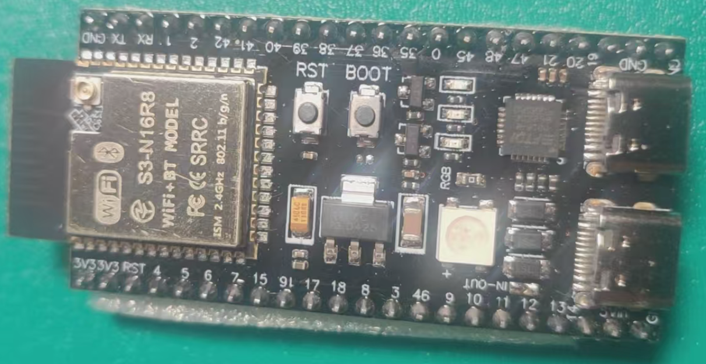
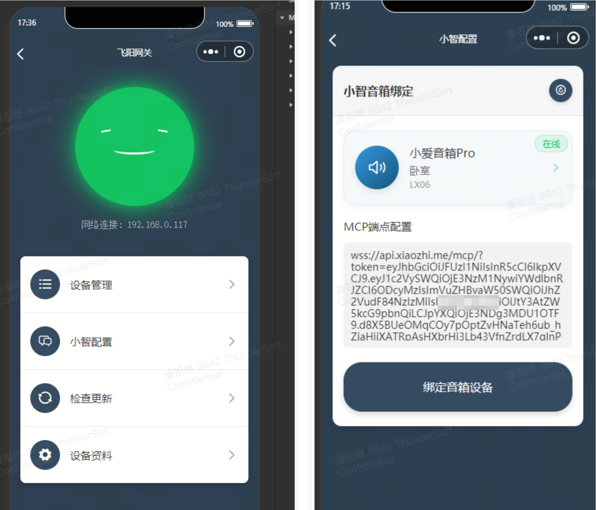

# ESP32 Smart Home Control System


## Project Overview

ESP32-based smart home control system that enables large language models to directly control Xiaomi AI speakers and smart devices

[Demo Video](https://b23.tv/0KlOaJY) | [Complete Tutorial](https://bxk64web49.feishu.cn/docx/XAVJdha5FoI5bjxKELqcz3rJnwg) | [Firmware Download](#-firmware-download)

---

> **Disclaimer**
>
> - This repository only provides compiled firmware, source code is not open
> - Please read the [LICENSE](LICENSE) agreement carefully before use

## 📖 Project Introduction

This project is an ESP32-based smart home control system that implements deep integration control of large language models "Xiaozhi" with Xiaomi AI speakers and Mi Home smart devices through MCP (Model Context Protocol) plugins.

### ✨ Key Features

- **🤖 AI Deep Integration**: Not just conversation, but intelligent control
- **🔌 MCP Plugin Architecture**: Encapsulates voice broadcasting and device control as standard services
- **🏠 Whole Home Intelligence**: Unified management of Mi Home ecosystem devices
- **💡 Smart Interaction**: Natural language directly converts to device operations

## 🚀 Technical Architecture


### 🔧 Implementation Principles

**MCP (Model Context Protocol)** serves as a bridge connecting large language models with hardware devices, registering core functions of Xiaomi AI speakers (voice broadcasting, device control) as standardized plugins. When "Xiaozhi" AI assistant recognizes relevant commands, it automatically calls corresponding hardware interfaces.

#### Core Components

1. **🔗 Mi Home Platform Integration**: Deep integration between ESP32 and Mi Home cloud services for device status synchronization and control
2. **⚡ MCP Service Interface**: Standardized plugin interface for easy AI model understanding and invocation
3. **💾 ESP32 Firmware**: High-performance, low-cost hardware solution supporting multi-device concurrent control

Through this architecture, you will have an AI-driven smart home control hub that applies artificial intelligence's understanding directly to the physical world.

## 🎯 Function Demonstration

### 📱 Device Query

**User Command**: `"Hello Xiaozhi, which devices are online at home?"`

**Execution Result**: Xiaozhi displays query results in the chat interface

```text
✅ Detected the following devices online:
- Living room lamp (online)
- Bedroom air conditioner (online)
- Kitchen socket (offline)
```

### 🎛️ Device Control

**User Command**: `"Please turn on the living room lamp, make it brighter and warmer"`

**Execution Result**:

- Living room lamp automatically turns on
- Brightness adjusted to 80%
- Color temperature switched to warm light mode

### 🔊 Voice Broadcasting

**User Command**: `"Let Xiaomi AI broadcast: Welcome to Yangyang Programming Channel!"`

**Execution Result**: Xiaomi AI speaker clearly broadcasts the specified content

> 💡 **Smart Interaction Flow**: Natural language command → AI understands intent → Calls MCP plugin → ESP32 executes → Device responds

## 📦 Firmware Download

### 🎵 Supported Xiaomi AI Speaker Models

| Series | Supported Models |
|--------|------------------|
| **Classic Series** | `07G`, `16B`, `L04M`, `L05B`, `L05C`, `L05G`, `L06A` |
| **LX Series** | `LX01`, `LX04`, `LX05`, `LX06`, `LX5A` |
| **Pro Series** | `L09A`, `L09B`, `L15A`, `L16A`, `L17A`, `L7A` |
| **X Series** | `X08A`, `X08C`, `X08E`, `X10A`, `X4B`, `X6A`, `X8F`, `X8S` |
| **Others** | `M03A`, `OH2`, `OH2P`, `S12` |

### 💻 Supported ESP32 Hardware

#### ✅ Recommended Configuration

ESP32-S3-R16N8 (Fully Verified)

- 16MB PSRAM + 8MB Flash
- Complete function support, including online upgrade



#### ⚠️ Basic Configuration

ESP32 (Flash > 4MB)

- Basic function support
- Online upgrade function not available


### 📥 Firmware Download Address

**Latest Version**: v1.0.15  
**Release Date**: June 15, 2025

🔗 **Download Link**: [https://gitee.com/panzuji/ha-esp32/releases/tag/v1.0.15](https://gitee.com/panzuji/ha-esp32/releases/tag/v1.0.15)

#### 📋 Firmware File Description

| Filename | Compatible Device | Description |
|----------|-------------------|-------------|
| `esp32.esp32.esp32_flash4M_1.0.15.zip` | ESP32 (4MB Flash) | Basic functions, no online upgrade |
| `esp32.esp32.esp32_flash8M_1.0.15.zip` | ESP32 (8MB Flash) | Complete function support |
| `esp32.esp32.esp32s3_flash8M_1.0.15.zip` | ESP32-S3 (Recommended) | Best performance, complete functions |

> 💡 **Download Tip**: Recommend choosing the ESP32-S3 version for optimal performance and complete function support

## 📱 Alternative Solution: Android Xiaozhi

If you don't have ESP32 hardware temporarily, you can use the Android version of Xiaozhi client, which can also achieve basic smart control functions.

### Configuration Steps

1. Install Android Xiaozhi application
2. Fill in the following information in the settings page:
   - **WebSocket Address**: Server connection address
   - **MAC Address**: Must match the ESP32 device MAC address registered on Xiaozhi official website <https://xiaozhi.me>


## 🔧 Firmware Flashing Tutorial

### ESP32-S3 Flashing Guide

For detailed firmware flashing steps, please refer to the official documentation:

📖 **Flashing Tutorial Document**: [ESP32-S3 Firmware Flashing Guide](https://bxk64web49.feishu.cn/docx/GFktdztS8o5tztxsHpKcmjzrnAc)

> 💡 **Tip**: For first-time flashing, it's recommended to follow the documentation steps to ensure correct firmware writing

## 📱 WeChat Mini Program Client

### 💫 Feiyang Smart Control Mini Program

Search **"飞阳智控"** in WeChat to use

### 📋 Device Addition Process

1. Create "Feiyang Gateway" device in the "Feiyang Smart Control" mini program
2. Obtain device key for ESP32 network configuration


### 🔗 Xiaozhi Binding Configuration

#### Operation Steps

1. Open the "Add Smart Configuration" function in the mini program
2. Bind your Xiaozhi speaker device
3. Enter MCP endpoint key (obtain from <https://xiaozhi.me>)
4. Confirm and submit binding information



#### 🔑 Get Xiaozhi MCP Key

**Step 1**: Visit Xiaozhi official website and log in


**Step 2**: Copy MCP key in the control panel


## 🌐 ESP32 Device Network Configuration

### 📶 WiFi Network Configuration Process

1. **Start Configuration Mode**
   - After firmware flashing is complete, ESP32 will create a WiFi hotspot named "阳阳学编程"
   - Connect to this hotspot using phone or computer

2. **Configure Network Parameters**
   - System will automatically open the configuration page
   - Enter the following information:
     - Device key (obtained from mini program)
     - Home WiFi password

3. **Complete Network Connection**
   - After confirming configuration, device will automatically connect to home network

> 📹 **Configuration Demo Video**: [Detailed Network Configuration Operation Guide](https://bxk64web49.feishu.cn/docx/GFktdztS8o5tztxsHpKcmjzrnAc)

### 🔐 Xiaomi Account Authorization

After network configuration is complete, Xiaomi platform authorization is required to control Mi Home devices:

#### Access Authorization Page

1. Open in computer browser: <http://homeassistant.local:8123>
2. If unable to access, possible solutions:
   - Turn off other HomeAssistant devices at home
   - Manually configure system hosts file

#### Configure hosts File (if needed)

Point domain name `homeassistant.local` to ESP32's IP address:


#### Complete Authorization

- **First Login**: Enter Xiaomi account and password
- **Logged-in Users**: Click confirm authorization


## ⚠️ Precautions and Common Issues

### 🔧 Device Compatibility

Due to different device models requiring specific interface parameters, currently tested device types are limited. If you encounter the following situations:

- Command not responding
- Device control failure
- Function abnormality

Please provide feedback on your device model information in project Issues, and we will promptly adapt and update.

### ❓ Troubleshooting Table

| Problem Phenomenon | Possible Cause | Solution |
|-------------------|----------------|----------|
| 🔴 **Device Parameter Adaptation Failed** | Device model not yet supported | Wait for firmware update or provide device feedback |
| 🟡 **Voice Command Not Responding** | Device model not fully adapted | Provide device model in Issues |
| 🟢 **Function Normal but Occasional Abnormality** | Network or device status issues | Check network connection and device status |

### 💬 Problem Feedback

When encountering problems, please provide the following information:

- ESP32 hardware model
- Xiaomi AI speaker model
- Specific error phenomena
- Operation steps

---

## 📞 Technical Support

### 📺 Educational Resources

- **Bilibili/Douyin**: Yangyang Programming
- **Complete Tutorial Documentation**: [Project Detailed Tutorial](https://bxk64web49.feishu.cn/docx/XAVJdha5FoI5bjxKELqcz3rJnwg)

### 🤝 Community Support

- **Issues Feedback**: Project Issues page
- **Technical Exchange**: Welcome to Star and Fork this project

---

## 🚀 Let AI Truly Control Your Smart Home, Starting with ESP32

[](https://gitee.com/panzj/ha-esp32)
[](https://bxk64web49.feishu.cn/docx/XAVJdha5FoI5bjxKELqcz3rJnwg)
